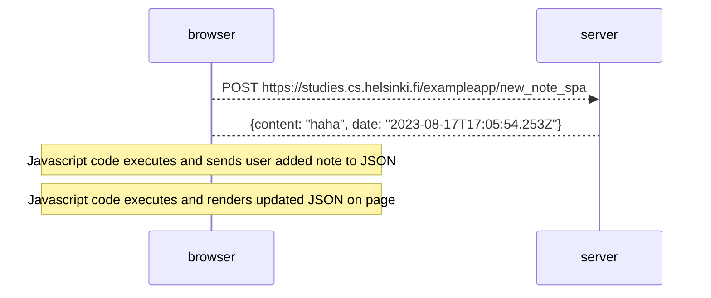

```mermaid
sequenceDiagram
participant browser
participant server

browser -->> server: POST https://studies.cs.helsinki.fi/exampleapp/new_note_spa
browser --> server: {content: "haha", date: "2023-08-17T17:05:54.253Z"}
note over browser: Javascript code executes and sends user added note to JSON
note over browser: Javascript code executes and renders updated JSON on page

```